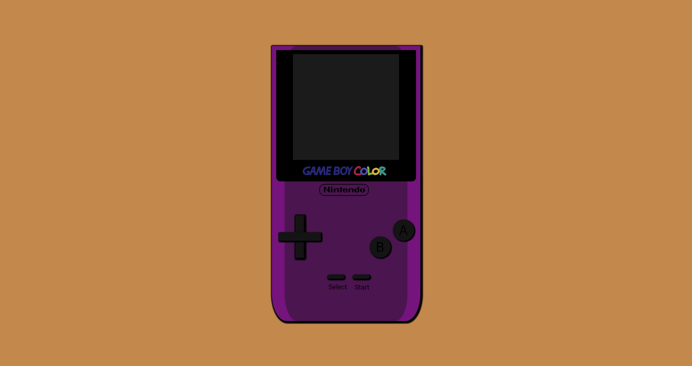

# My Video Console🎮

## Table of Contents

- [About](#about)
- [Getting Started](#getting_started)

## About 

This is the first project in which I created a video console using HTML and CSS and the other tools

## Getting Started 

What can be seen is how using all the steps learned in class and others investigated in different sites I was able to represent a Game Boy Color.
And this is the demo [Nintendo](https://luisroquett.github.io/videoconsole/)

