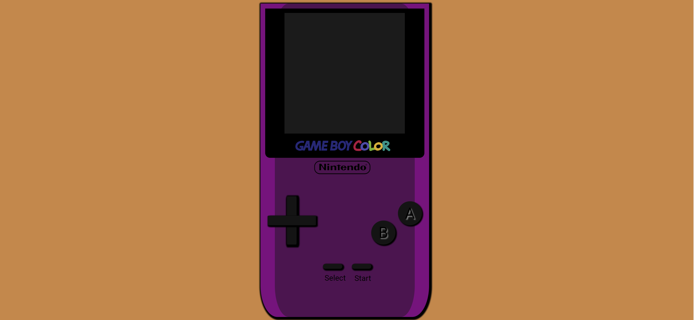

# My Video Console🎮

## Table of Contents

- [About](#about)
- [Getting Started](#getting_started)
- [My goal](#my_goal)
- [Demo](#demo)
- [Future functionalities](#future)

## About 

This is the first project in which I created a video console using HTML and CSS and the other tools

## Getting Started 

What can be seen is how using all the steps learned in class and others investigated in different sites I was able to represent a Game Boy Color.

## Result View

## Demo 

This is the demo of the [Nintendo](https://luisroquett.github.io/videoconsole/)

## My goal 

My goal is to be able to show a video console and make it look very real and workable.

## Future functionalities 

⬜ 100% functional screen 
⬜ Enable A B Start and Select buttons

## Thanks to:

Professor Fidel Gilart & Mara Scampini
 

